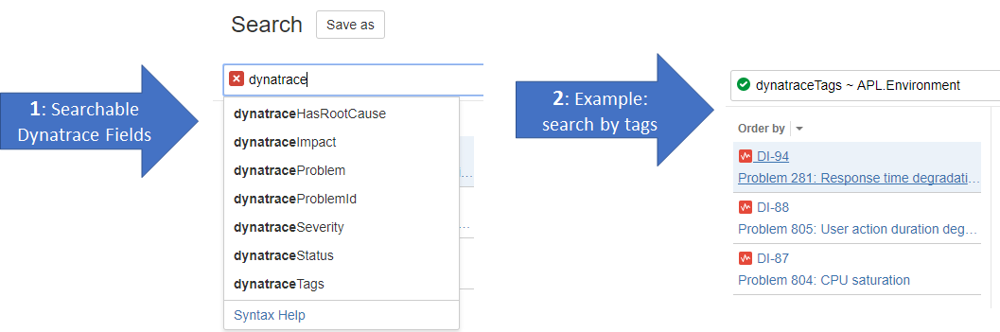
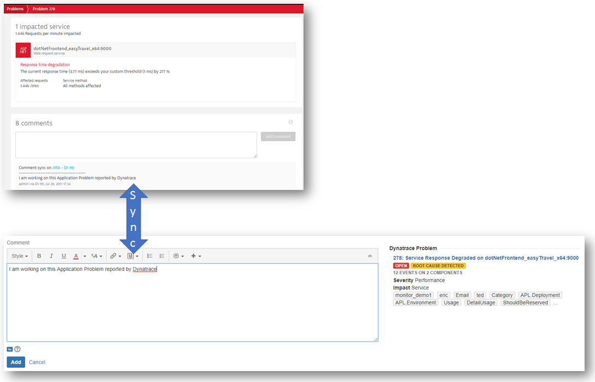

# Dynatrace JIRA Cloud Connect Add-On

The Dynatrace JIRA Cloud Connect Add-On enables several Use-Cases for [JIRA Cloud](https://www.atlassian.com/software/jira)
* Live Dynatrace Problem Status and Problem Events in JIRA ticket
* Automatically link JIRA tickets with Dynatrace Problems
* Synchronize JIRA ticket comments with Dynatrace Problems
* Direct links to root cause dashboards from your JIRA ticket
* Enable JQL queries based on Dynatrace Problem data: severity, impact, tags, ...
* Query Dynatrace metrics from your JIRA ticket

Want to see the Add-On in action? [Watch this video]()
Want to learn more about our learnings when we implemented this Add-On? [Read our Atlassian Connect blog]()

## Getting started with this Add-On
In order to use this integration you need
1. A Dynatrace FullStack instance (Managed or SaaS): [Get your own Dynatrace SaaS Trial in 3 minutes](https://www.dynatrace.com/trial/?utm_source=andreasgrabner&utm_medium=github&utm_content=voucher&utm_campaign=1000-free-hours-andreasgrabner)
2. A Dynatrace API Token: In Dynatrace go to Settings -> Integration -> Dynatrace API and create a new token
3. A JIRA cloud instance: [Get your JIRA Cloud instance](https://www.atlassian.com/software/jira/try)
4. (optionally but recommended). Configure the [Dynatrace to JIRA Integration](https://www.dynatrace.com/blog/integrate-jira-issue-tracking-dynatrace-environment/).

In your JIRA instance navigate to "Managed Add-Ons". As we haven't published the Add-On on the Atlassian Marketplace yet simply follow these steps
1. Click on "Upload add-on"
2. Enter: https://atlassian-connect.dynatracelabs.com/atlassian-connect.json
3. Once the Add-On is installed click on "Configure"
4. Enter your Dynatrace Tenant URL as well as a Dynatrace API token.

# Key Use Cases explained!
For more details on each use case we recommend to read our [Atlassian Connect Week Austin 2017 blog]() where we explained the technical implementation of the following use cases:

## Linking a JIRA ticket with a Dynatrace Problem
The linkage between a JIRA ticket and a Dynatrace Problem is done by storing the Dynatrace Problem ID as an [Entity Property](https://developer.atlassian.com/jiradev/jira-platform/building-jira-add-ons/jira-entity-properties-overview) on the JIRA ticket. The property is named "dynatraceProblemId" and contains a JSON object with details such as "Unique Dynatrace Problem ID", "Severity", "Impact", "Tags", "Status". The property itself is not visible to the end user. End users can however use JQL (JIRA Query Language) to search for JIRA tickets that are associated with a Dynatrace Problem. 
The "dynatraceProblemId" entity property is set in different scenarios
1. Our Dynatrace to JIRA Integration will create JIRA tickets and automatically set this property.
2. 3rd party tools such as xMatters set this property when forwarding a Dynatrace Problem to JIRA
3. Our JIRA Add-On scans and parses links to Dynatrace Problem URLs in JIRA ticket descriptiosn and comments. If detected the entity property is stored. 

## Live Problem Status Overview
If the JIRA ticket is linked with a Dynatrace Problem the Add-On will query LIVE data through the Dynatrace Problem REST API and display the information in a panel.

## Live Problem Events Feed
The Dynatrace Events tab automatically pulls in all comments and correlated problem events from the linked Dynatrace Problem. The list highlights special events and provides direct links to Dynatrace root cause dashboards

## JQL Support
The linked Dynatrace problem data including Tags, Impact, Severity, Status, ... is indexed by JIRA. This allows JIRA users to query JIRA tickets that are linked to Dynatrace Problems. This is especially useful to search for related problems.

## Synchronize Comments
If you add a comment to a JIRA ticket we do not only scan for a link to a Dynatrace Problem to link the ticket with that problem. In case the JIRA ticket is already linked we push the comment to the Dynatrace side so that the comment can be seen in both JIRA and Dynatrace.

## Query Dynatrace metrics
As a JIRA user you can execute a query against Dynatrace to pull LIVE metrics for certain entites, e.g: Number of Active Users on the website or Response Time of a service. This allows you to close the Feedback Loop from Operations & Testing back into your development team.

## What's next?
Give us feedback on further extensions to the Add-On. Which use cases are missing? Would you also like to see tighther integrations with other Atlassian tools?
